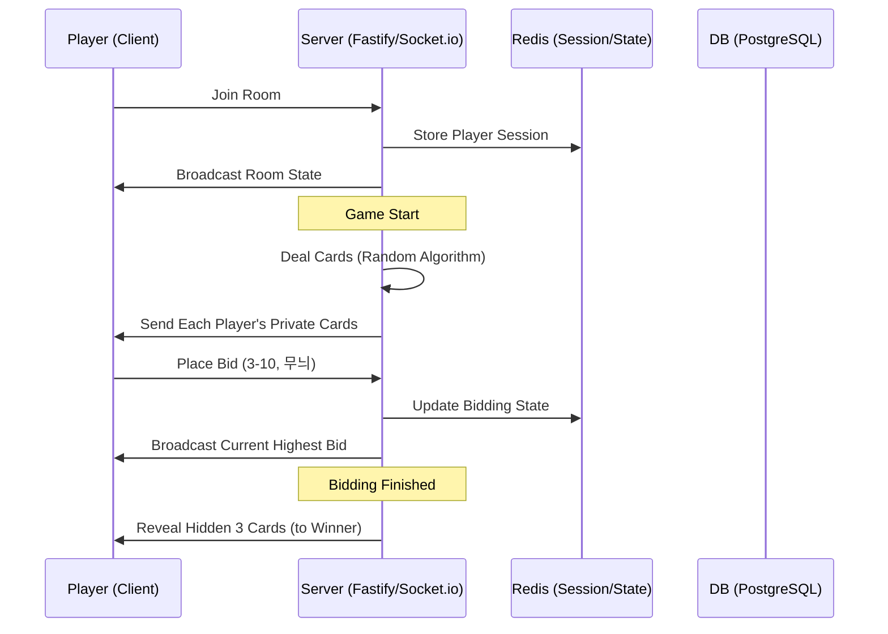

# 기술 스택 및 아키텍처 결정 (ADR)

본 문서는 마이티 온라인 프로젝트의 기술적 기반과 시스템 구조에 대한 결정 사항을 기록합니다.

---

## 1. 기술 스택 (Tech Stack)

| 구분 | 기술 | 선정 사유 |
| :--- | :--- | :--- |
| **언어** | **TypeScript** | 프런트/백엔드 타입 공유를 통한 비즈니스 로직(카드 규칙)의 안정성 확보. |
| **프런트엔드** | **Next.js 15+ (App Router)** | 고성능 렌더링, SEO 최적화 및 안정적인 프로덕션 환경. |
| **백엔드** | **Fastify (Node.js)** | Express 대비 압도적인 성능과 플러그인 기반의 확장성. |
| **실시간 통신** | **Socket.io** | 양방향 통신, 자동 재연결(Reconnection) 및 Redis 어댑터를 통한 확장 용이성. |
| **상태 관리** | **Zustand** | 가볍고 직관적인 클라이언트 게임 상태 관리. |
| **스타일링** | **Tailwind CSS v4** | 빠른 개발 속도와 일관된 디자인 시스템(Tokens) 적용. |
| **DB & 저장소** | **PostgreSQL & Redis** | 매칭 및 영구 정보는 Postgres, 실시간 게임 세션 및 채널 정보는 Redis 관리. |

---

## 2. 시스템 아키텍처 (Architecture)

### 2.1 게임 엔진: 유한 상태 머신 (FSM)
게임의 흐름을 명확한 상태로 관리하여 로직의 꼬임을 방지합니다.
- `WAITING` -> `BIDDING` -> `FRIEND_SELECTING` -> `PLAYING` -> `RESULT` -> `SETTLEMENT`

### 2.2 실시간 동기화 및 이탈 처리
- **Heartbeat**: 5초 간격으로 클라이언트 상태를 체크합니다.
- **이탈 정책 (B)**: 플레이어 접속 종료 시 Redis에 상태를 유지하며 30초(가변) 대기 후, 미복귀 시 방을 파괴하고 정산 로직을 실행합니다.

### 2.3 보안 및 프렌드 정책 (A)
- **서버 중심 로직**: 프렌드 정보는 서버 세션에만 저장됩니다. 
- **필터링된 데이터 전달**: 소켓 통신 시 다른 플레이어에게는 프렌드 정보를 절대 전달하지 않으며, 특정 무늬/카드가 플레이되는 시점에만 서버가 프렌드 상태를 공개(Publicize)합니다.

---

## 3. 데이터 흐름 (Data Flow - Mermaid)

---

## 4. 핵심 구현 과제 (Key Challenges)
- **카드 규칙 엔진**: 마이티, 조커, 조콜 등의 복잡한 우선순위 로직을 TypeScript 클래스로 모듈화하여 FE/BE에서 재사용.
- **애니메이션**: 카드 배분 및 트릭 획득 시 시각적인 '타격감'을 위한 Framer Motion 연동.
- **정산**: 백런, 런 등을 포함한 모든 비딩 케이스(3~10) 자동 계산기 구현.

---

## 5. 열린 질문 (Open Questions)
- **인증 방식**: 단순 닉네임 기반인가요, 아니면 Google/Kakao 소셜 로그인이 필요한가요?
- **호스팅**: Vercel(프런트) + Fly.io/Render(백엔드) 조합을 선호하시나요?
